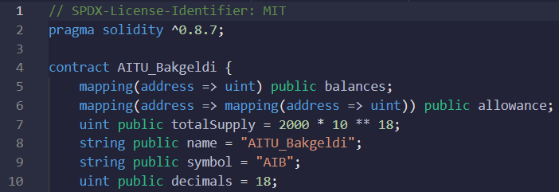
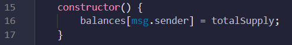
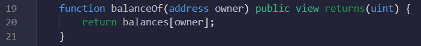

# ERC20 Token creation and transfer
Blockchain Technologies - Assignment #2

## Usage
### ERC20 Token creation
First, here is the code of creating the ERC20 standard token with initial total supply of 2000 tokens in a contract named 'AITU_Bakgeldi'. Name of the token is "AITU_Bakgeldi" and symbol is "AIB". Mapping is used to map each address to different balances.
 

Then constructor is created for msg.sender(admin), who has initial supply.
 

### Implementation of functionality to transfer from one account to another
Below is the code of the public and view(read-only) function to read the balance of any address. It passes the address and returns integer.
 

Next, here is the function to transfer token from one address to another address.
 

## Examples

## License
Contract is released under the [MIT License](LICENSE).
