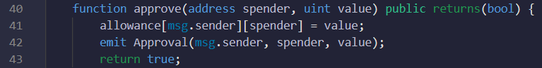
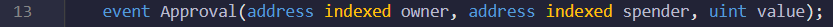
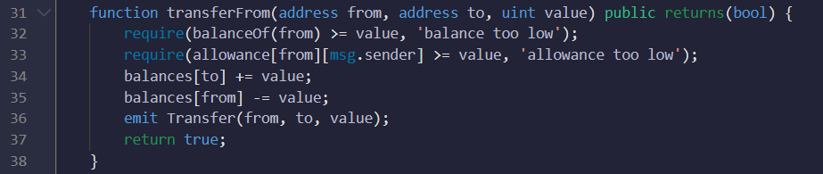
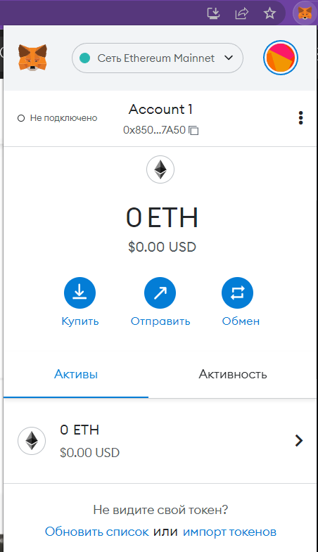
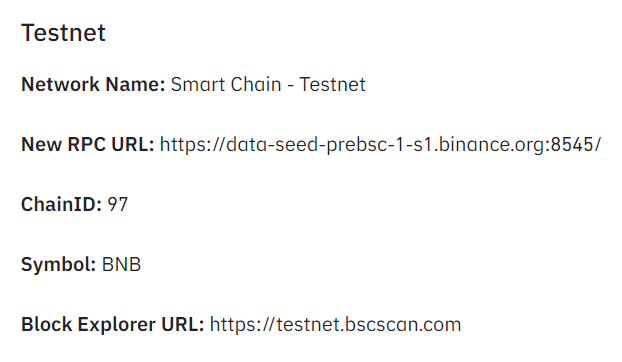
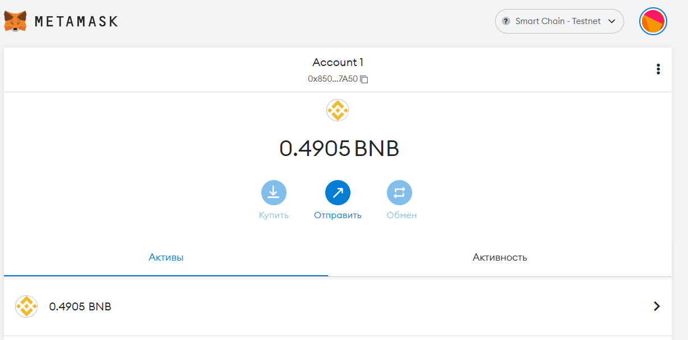
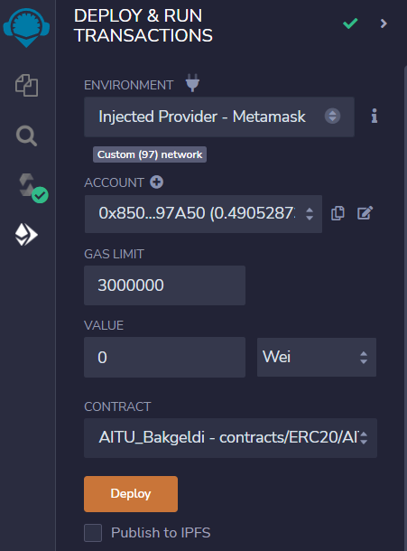
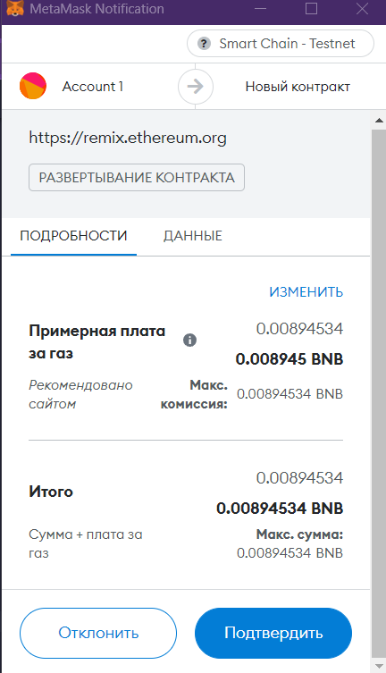

# ERC20 Token creation and transfer
Blockchain Technologies - Assignment #2

## Usage
### ERC20 Token creation
First, here is the code of creating the ERC20 standard token with initial total supply of 2000 tokens in a contract named 'AITU_Bakgeldi'. Name of the token is "AITU_Bakgeldi" and symbol is "AIB". Mapping is used to map each address to different balances.
 

Then constructor is created for msg.sender(admin), who has initial supply.
 

### Implementation of functionality to transfer from one account to another
Below is the code of the public and view(read-only) function to read the balance of any address. It passes the address and returns integer.
 

Next, here is the function to transfer token from one address to another address. It passes through the recipient address(to) and fraction of token(value). Function is public that returns boolean value. Inside of the transfer function, there is 'require' statement that allows to test logical condition, where if the condition is true then execution continues Otherwise, it will throw an error and end the transaction. If the condition is true, then the recepient's balance will be increased by the sended tokens.
 

While creating the 'transfer' function, the event Transfer should be created and emited in the function. In the event, 'indexed' means that we can filter the event from outside the blockchain. It takes all the event with the 'from' field equal for some value.
 

###Function for the delegated transfer
Delegated transfer allows another address to spend tokens on behalf of another address. New variable is created with the nested mapping, where mapping of address maps to adress that maps to integer. So, outer address will be the owner of the token, and for each token owner we can have a nested mapping with the address of spender and it will map to how much the spender can spend tokens on the behalf of the owner.
 

Next, function approve that allows how much spender can spend on the behalf of the owner(sender).
 

Then, event 'Approval' is created with the address of the owner and spender, and value. The event is emited in the function 'approve'.
 

Last function that does the delegated transfer is 'transferFrom' with parameters of owner's and recipient's addresses, and value(amount of tokens). First, the function will check that the owner has enough token to transfer. After, it will check allowance. If the condition is true, balance of the recipient will increase by the value recieved, and the balance of the owner(sender) will be decreased by the value sended. Also, 'Approval' event is emitted inside the function.
 

## Examples
### Deploying contract to BnB Chain
Install <a href='https://chrome.google.com/webstore/detail/metamask/nkbihfbeogaeaoehlefnkodbefgpgknn'>Metamask</a> extension for the Google Chrome.
 

Testnet of BnB Smart Chain - a safe playground that you can use when you develop smart contract on Binance Smart Chain. In order to deploy our smart contract, we need testnet BnB tokens. For that <a href='https://testnet.binance.org/faucet-smart'>Binance Smart Chain Faucet</a> is used. Copy the address of the account and put it in the Binance Smart Chain Faucet, press 'Give me BNB' button.

Open Metamask and add custom network. Fill with the data below.
 

Connected to the BnB Smart Chain testnet with updated balance.
 

Go to deployment tab in the Remix-Ethereum IDE. Change environment to Injected Provider - Metamask, and connect. 
 

Click Deploy and confirm the gas spend for the process.
 

## License
Contract is released under the [MIT License](LICENSE).
