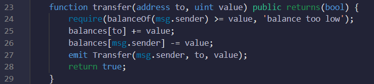

# ERC20 Token creation and transfer
Blockchain Technologies - Assignment #2

## Usage
### ERC20 Token creation
First, here is the code of creating the ERC20 standard token with initial total supply of 2000 tokens in a contract named 'AITU_Bakgeldi'. Name of the token is "AITU_Bakgeldi" and symbol is "AIB". Mapping is used to map each address to different balances.
 

Then constructor is created for msg.sender(admin), who has initial supply.
 

### Implementation of functionality to transfer from one account to another
Below is the code of the public and view(read-only) function to read the balance of any address. It passes the address and returns integer.
 

Next, here is the function to transfer token from one address to another address. It passes through the recipient address(to) and fraction of token(value). Function is public that returns boolean value. Inside of the transfer function, there is 'require' statement that allows to test logical condition, where if the condition is true then execution continues Otherwise, it will throw an error and end the transaction. If the condition is true, then the recepient's balance will be increased by the sended tokens.
 

While creating the 'transfer' function, the event Transfer should be created and emited in the function. In the event, 'indexed' means that we can filter the event from outside the blockchain. It takes all the event with the 'from' field equal for some value.
 

## Examples

## License
Contract is released under the [MIT License](LICENSE).
